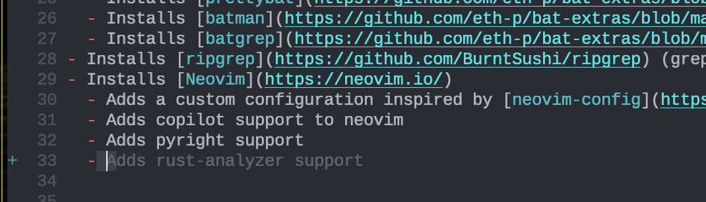
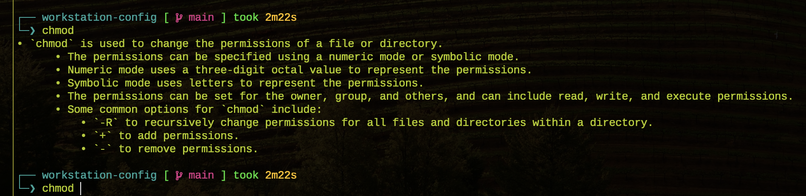
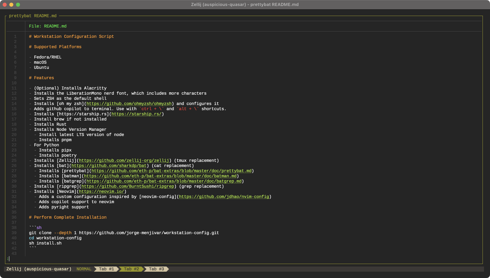
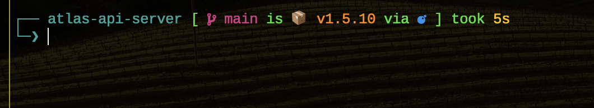
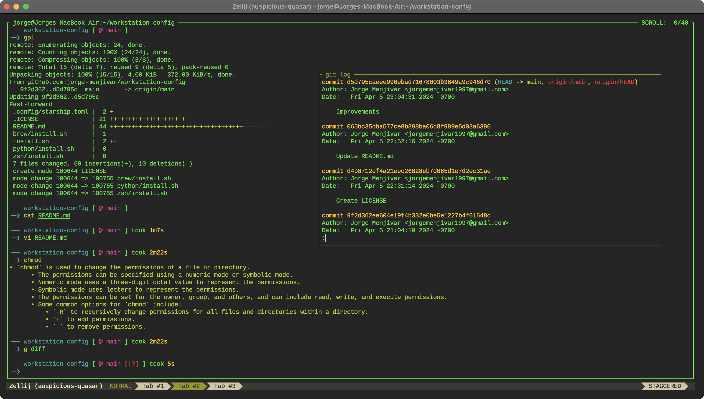

# Workstation Configuration Script

# Supported Platforms
- Fedora/RHEL
- macOS
- Ubuntu

# Installation

```sh
git clone --depth 1 git@github.com:jorge-menjivar/modern-terminal.git
cd modern-terminal
bash install.sh
```

# Restore Configuration Files

Only restore configuration files if you already installed everything.
```sh
bash restore.sh
```

# Features
- (Optional) Installs Alacritty
- Installs the LiberationMono nerd font, which includes more characters
- Sets ZSH as the default shell
- Installs [oh my zsh](https://github.com/ohmyzsh/ohmyzsh) and configures it
- Adds github copilot to terminal.
  - linux: Use with `ctrl + \` to explain, and `alt + \` to suggest.
  - macOS: Use with `ctrl + \` to explain, and `option + \` to suggest.
- Installs [https://starship.rs](https://starship.rs/)
- Install brew if not installed
- Installs Rust
- Installs Node Version Manager
  - Install latest LTS version of node
  - Installs pnpm
- For Python
  - Installs pipx
  - Installs poetry
- Installs [Zellij](https://github.com/zellij-org/zellij) (tmux replacement)
- Installs [bat](https://github.com/sharkdp/bat) (cat replacement)
  - Installs [prettybat](https://github.com/eth-p/bat-extras/blob/master/doc/prettybat.md)
  - Installs [batman](https://github.com/eth-p/bat-extras/blob/master/doc/batman.md)
  - Installs [batgrep](https://github.com/eth-p/bat-extras/blob/master/doc/batgrep.md)
- Installs [ripgrep](https://github.com/BurntSushi/ripgrep) (grep replacement)
- Installs [Neovim](https://neovim.io/)
  - Adds a custom configuration inspired by [neovim-config](https://github.com/jdhao/nvim-config)
  - Adds copilot support to neovim
  - Adds pyright support


# Screenshots

## GitHub Copilot in Neovim


## Github Copilot in Terminal


## Colorized `cat` Command Output


## Pretty Terminal with Starship


## Zellij

